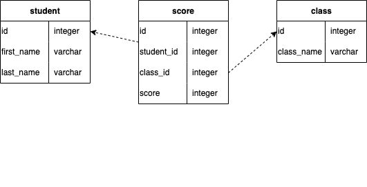
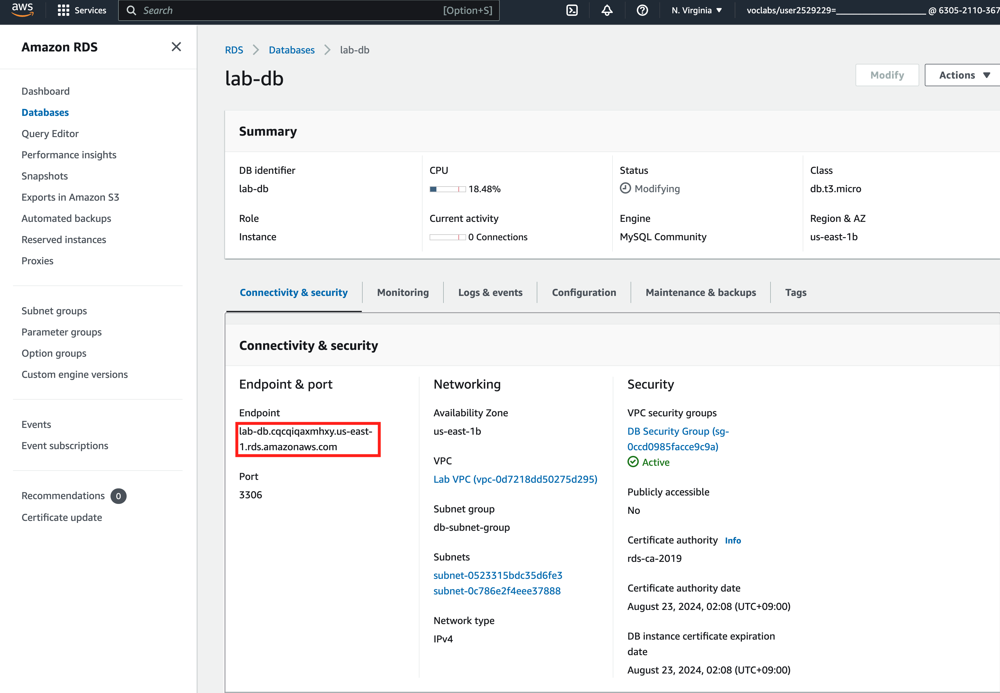

# 6/6 の授業内容
## 座学　AWS Academy Cloud Foundations
* コースの説明
* [x] モジュール1
* [ ] モジュール2
* [ ] モジュール3
* [ ] モジュール4
* [x] モジュール5
* [x] モジュール6
* [x] モジュール7
* [ ] モジュール8 <- ラボ5から
* [ ] モジュール9
* [ ] モジュール10

## ラボ5 の追加課題
SQL を使用してデーターベースを操作する

### テーブル構成


#### student(生徒)
* id: 生徒を一意に識別するID
* first_name: 名
* last_name: 姓
#### class(科目)
* id: 科目を一意に識別するID
* class_name: 科目の名称
#### score(点数)
* id: 点数を一意に識別するID
* student_id: 関連付ける生徒のID
* class_id: 関連付ける科目のID
* score: 点数

### 環境準備
1. 「Web Server 1」に SSH で接続する
PuTTY を使用する

2. mysql client をインストーする
    ```
    sudo yum localinstall -y https://dev.mysql.com/get/mysql80-community-release-el7-3.noarch.rpm
    sudo yum install -y mysql-community-client
    ```

3. mysql client がインストールされたことの確認
    ```
    mysql --version
    mysql  Ver 15.1 Distrib 10.5.18-MariaDB, for Linux (x86_64) using  EditLine wrapper
    ```

4. RDS のエンドポイントを確認する
AWS Management Console の RDS サービスから RDS のエンドポイントを確認する。  
以下の画面の赤枠の箇所をコピーしておく。

    

5. mysql コマンドで データベースに接続する
Web Server 上で以下のコマンドを実行してデーターベースに接続する
```
mysql -h "4. でコピーしたエンドポイント" -umain -plab-password lab
```

6. テーブルを作成する
データベースに接続した状態で、[create..sql](./create.sql) にかかれている内容をコピー & ペーストして実行する。

以下のように表示されればOK
```
+------------+-----------+-------------+-------+
| first_name | last_name | class_name  | score |
+------------+-----------+-------------+-------+
| Taro       | Suzuki    | Mathematics |    90 |
| Taro       | Suzuki    | English     |    53 |
| Taro       | Suzuki    | Chemistry   |    76 |
| Hanako     | Mochizuki | Mathematics |    67 |
| Hanako     | Mochizuki | Chemistry   |    43 |
| Yuko       | Tanaka    | Mathematics |    55 |
| Yuko       | Tanaka    | English     |    77 |
| Yuko       | Tanaka    | Chemistry   |    66 |
| Tomoko     | Hayashi   | Mathematics |   100 |
| Tomoko     | Hayashi   | English     |    79 |
| Tomoko     | Hayashi   | Chemistry   |    97 |
| Jiro       | Nakata    | Mathematics |    23 |
| Jiro       | Nakata    | English     |    45 |
| Jiro       | Nakata    | Chemistry   |    77 |
+------------+-----------+-------------+-------+
14 rows in set (0.002 sec)
```

### 課題
データベースに接続した状態で以下を実施します。

1. 生徒の名前(first_name, last_name)と平均点を表示してみましょう。  
平均の計算はAVG関数を使います。

2. 50点以下の点数をとった生徒の名前(first_name, last_name)とクラス名、点数を表示してみましょう。
