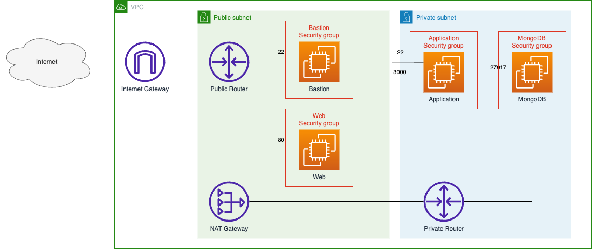
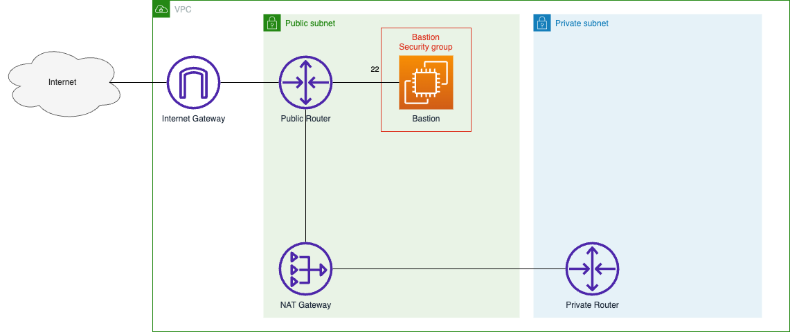

# セキュアなネットワークの構築
セキュアなネットワークを構築し、その上に [Growi](https://docs.growi.org/ja/) を構築する。

---
## Growi とは
Markdown でドキュメントを書くことができる Wiki ツールです。

---
## この課題で作成するシステムの構成


---
## 環境の初期化
CloudFormation を使用して環境を初期化します。

初期化後の環境は以下のようになります。


1. CloudShell を起動する

2. [template.yaml](./cfn/template.yaml) を CloudShell 上にアップロードする

3. 環境を初期化  
    CloudFormation の Stack を作成

    以下のコマンドを実行して環境を初期化します。
    ```
    aws cloudformation create-stack \
    --stack-name initialize \
    --template-body file://template.yaml
    ```
---
## 環境を構築する
### EC2 インスタンスを用意する
#### __Web サーバを用意する__
1. Web サーバ用のセキュリティグループを作成する
  * VPC サービスに移動
  * 左のメニューから Security groups を選択
  * [Create Security Group] を押す
  * 以下の項目を入力
    * Security group name: web security group
    * Description: for web server
    * VPC: 環境の初期化で作成した VPC のID
  * [Add Rule] を押して Inbound rules を追加
    * Type: SSH
    * Source: bastion security group
  * [Add Rule] を押して Inbound rules を追加
    * Type: HTTP
    * Source: AnywhereIPv4
  * [Create security group] を押す

2. EC2 インスタンスを作成する
  * EC2 サービスに移動
  * 左のメニューから instances を選択
  * [Launch instances] を押す
  * Name: web
  * AMI: Amazon Linux 2023 を使用する
  * Key pair: vockey を使用する
  * Network Settings で [Edit] を押す
    * VPC: MyVPC (環境の初期化で作成した VPC) を選択
    * Subnet: Public-subnet1 (環境の初期化で作成した Subnet) を選択
    * Auto-assign public IP: Enable を選択
  * Firewall (security groups): web security group (1.で作成したセキュリティグループ) を選択
  * [Launch instance] を押す

#### __Application サーバを構築する__
1. Application サーバ用のセキュリティグループを作成する
  * VPC サービスに移動
  * 左のメニューから Security groups を選択
  * [Create Security Group] を押す
  * 以下の項目を入力
    * Security group name: application security group
    * Description: for application server
    * VPC: 環境の初期化で作成した VPC のID
  * [Add Rule] を押して Inbound rules を追加
    * Type: SSH
    * Source: bastion security group
  * [Add Rule] を押して Inbound rules を追加
    * Type: Custom TCP
    * Port range: 3000
    * Source: web security group
  * [Create security group] を押す

2. EC2 インスタンスを作成する
  * EC2 サービスに移動
  * 左のメニューから instances を選択
  * [Launch instances] を押す
  * Name: application
  * AMI: Amazon Linux 2023 を使用する
  * Key pair: vockey を使用する
  * Network Settings で [Edit] を押す
    * VPC: MyVPC (環境の初期化で作成した VPC) を選択
    * Subnet: Private-subnet1 (環境の初期化で作成した Subnet) を選択
    * Auto-assign public IP: Disable を選択
  * Firewall (security groups): web security group (1.で作成したセキュリティグループ) を選択
  * [Launch instance] を押す

#### __MongoDB サーバを構築する__
1. MongoDB サーバ用のセキュリティグループを作成する
  * VPC サービスに移動
  * 左のメニューから Security groups を選択
  * [Create Security Group] を押す
  * 以下の項目を入力
    * Security group name: mongodb security group
    * Description: for mongodb server
    * VPC: 環境の初期化で作成した VPC のID
  * [Add Rule] を押して Inbound rules を追加
    * Type: SSH
    * Source: bastion security group
  * [Add Rule] を押して Inbound rules を追加
    * Type: Custom TCP
    * Port range: 27017
    * Source: application security group
  * [Create security group] を押す

2. EC2 インスタンスを作成する
  * EC2 サービスに移動
  * 左のメニューから instances を選択
  * [Launch instances] を押す
  * Name: application
  * AMI: Amazon Linux 2 を使用する
  * Key pair: vockey を使用する
  * Network Settings で [Edit] を押す
    * VPC: MyVPC (環境の初期化で作成した VPC) を選択
    * Subnet: Private-subnet1 (環境の初期化で作成した Subnet) を選択
    * Auto-assign public IP: Disable を選択
  * Firewall (security groups): application security group (1.で作成したセキュリティグループ) を選択
  * [Launch instance] を押す
