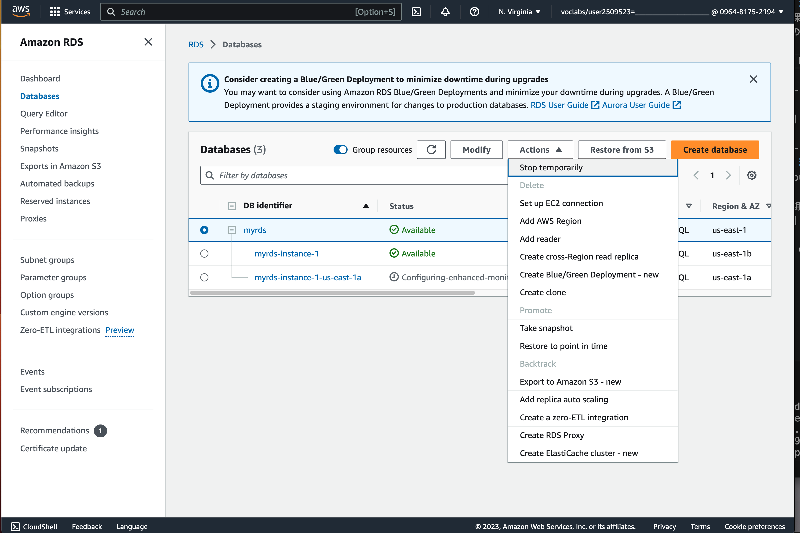

# RDS を触ってみる
以下のハンズオンを実施する

https://docs.kawashima-kazuh.com/hands-on/05.RDSを触ってみる/index.html

---
## 注意事項
本課題で作成するAuroraは動作させておくとクレジットの消費が激しいです。  
そのため、Lab終了時には Aurora を停止するようにしてください。

# 課題
作成した RDS を使用して WordPress を起動する

[EC2でWordPressを起動する](https://docs.kawashima-kazuh.com/hands-on/03.EC2でWordPressを起動する/index.html) を参考にして 作成した RDS を使用して WordPress を起動する

### 注意点
1. wordpress を起動する EC2 インスタンスは RDSと同じVPC(MyVPC) 上に用意する必要がある。
2. wordpress を起動する EC2 インスタンスはインターネットからアクセスできる必要がある。
3. RDS は wordpress からの通信を受け付ける必要がある。
4. wordpress の接続先を RDS に変更する必要がある。

### 提出物
演習完了後にチャットで完了を報告する

End Lab でラボは終了して良い
