# ECSでWordPressを起動する
この演習では、ECS, RDS, EFS を利用してWordPressを起動します。

## ECS とは
ECS は、Elastic Container Service の略で、コンテナを利用したサービスです。  
コンテナとは、Docker などで作成したイメージを利用して、環境を構築する仕組みです。

## 演習
以下の「Amazon EFS を利用した Amazon ECS on AWS Fargate での WordPress の実行」を参照して、演習を行ってください。

https://aws.amazon.com/jp/blogs/news/running-wordpress-amazon-ecs-fargate-ecs/

### 注意点
* 環境を構築するリージョンは `us-east-1` とします。
* 演習で実行する AWS CLI は Cloud 9 で実行してください。
  * 提出後に使用したファイルやコマンドの履歴を確認します。
* 「ベースとなるインフラストラクチャの作成」実施後にターゲットグループを修正する必要があります。
  * [ヘルスチェックの値を変更する](#ヘルスチェックの値を変更する) の手順に従って修正してください。
* 演習内で hey を使って負荷をかける箇所があります。Cloud 9 に hey がインストールされていないので、以下のコマンドでダウンロードしてください。

```bash
curl https://hey-release.s3.us-east-2.amazonaws.com/hey_linux_amd64 -o hey
```

ダウンロードしたファイルに実行権限を付与してください。
```bash
chmod +x hey
```

## ヘルスチェックの値を変更する
1. EC2 サービスに移動し、左のメニューから `Target Groups` から `WordPressTargetGroup` を選択します。
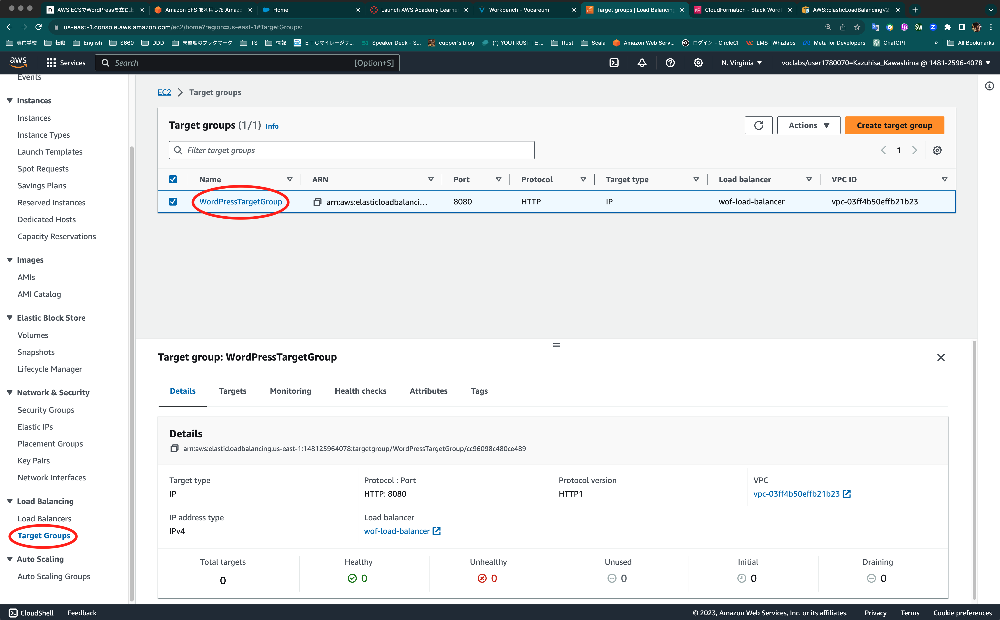

2. [Health Checks] タブから [Edit] をクリックします。
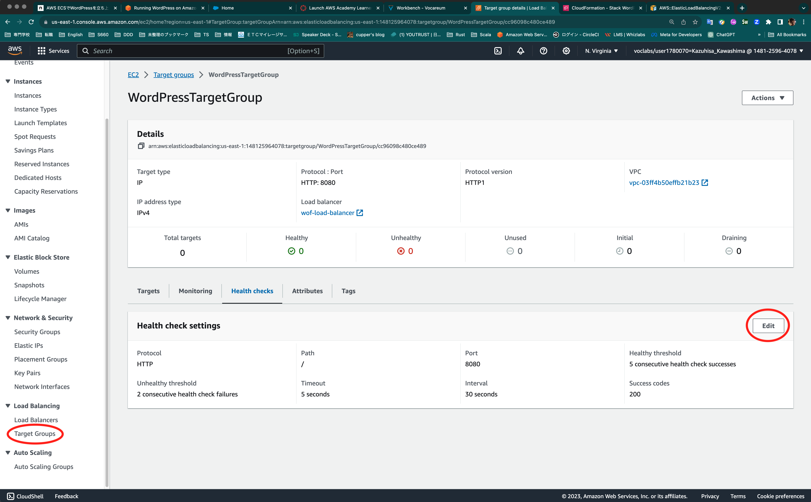

3. [Advanced health check settings] で [Sccess codes] に `301`, `302`を追加します。
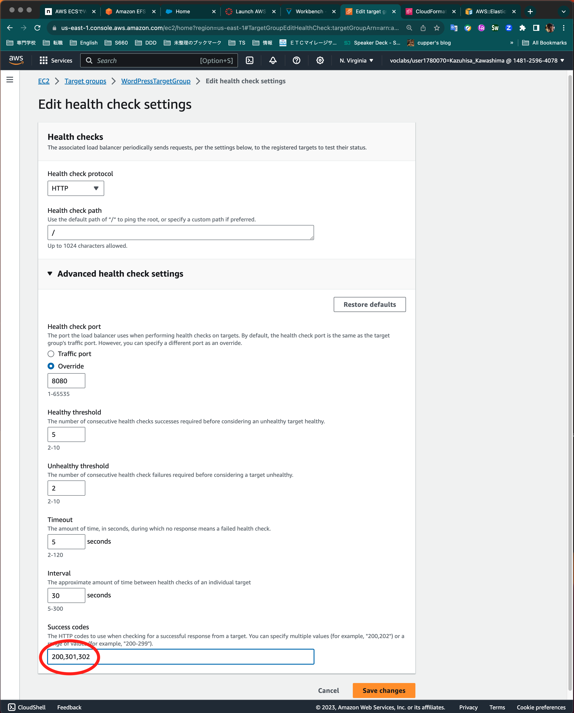

## 提出物
1. 演習で作成した環境をそのままにして完了したことをチャットで連絡してください。
2. 今回の演習で作成したリソースを AWS Management Console から確認して、画面のスクリーンショットを提出してください。  
__画面全体のスクリーンショットを提出してください。__

  * VPC の詳細情報  
  __関連するリソースがわかるようにResource mapを表示してください。__
  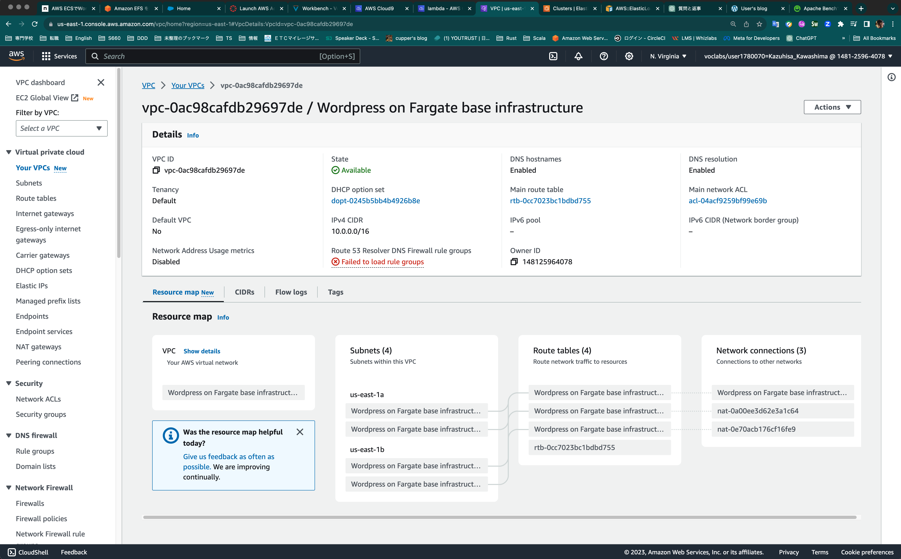

  * ブネットグループの一覧  
  __今回の演習に関係のあるサブネットだけ表示してください。__
  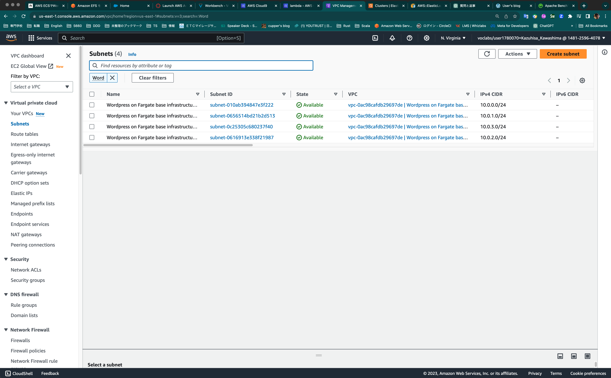

  * セキュリティグループのインバウンドルールの情報  
  __今回の演習で作成したセキュリティグループは4つあります。それぞれのセキュリティグループのインバウンドルールを表示してください。__
  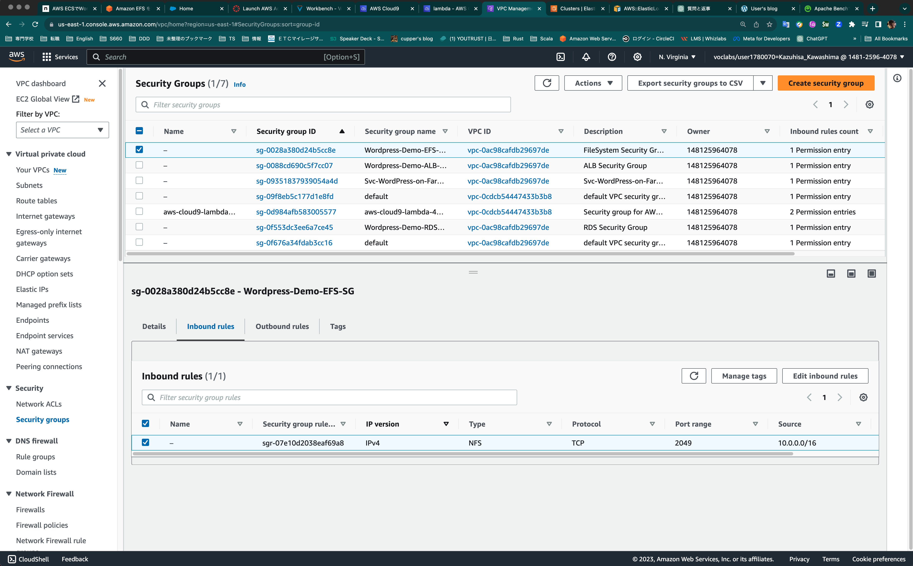 

  * ルートテーブルの情報  
  __ルーティングの情報と関連するサブネットがわかるように1つのルートテーブルごとに2つのスクリーンショットを提出してください。__  
  __今回の演習で作成したルートテーブルは3つあります。それぞれのルートテーブルの情報を表示してください。__
    * ルーティングの情報
    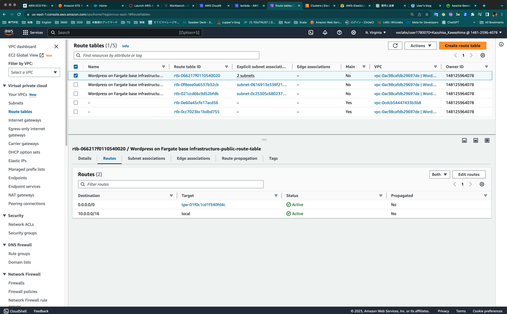

    * 関連するサブネットの情報
    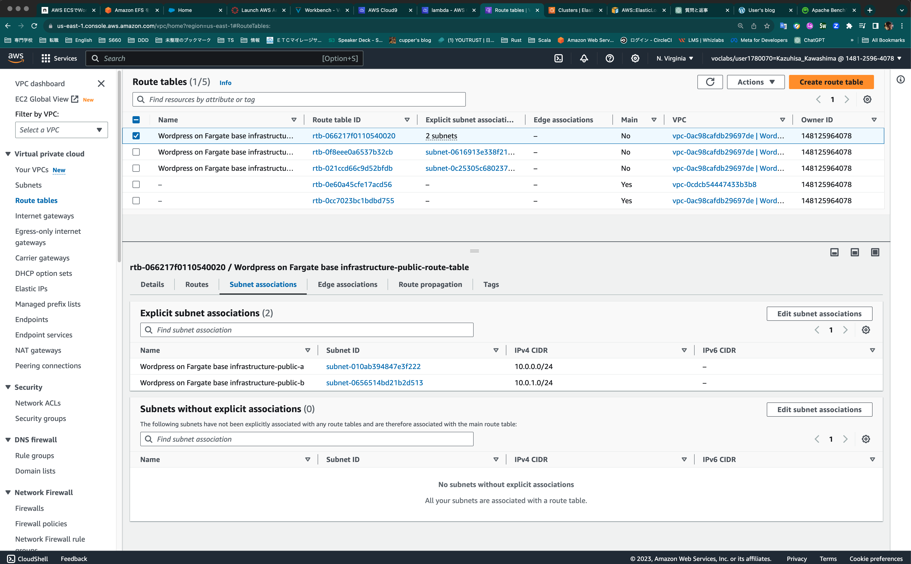
  
* DB インスタンスの情報
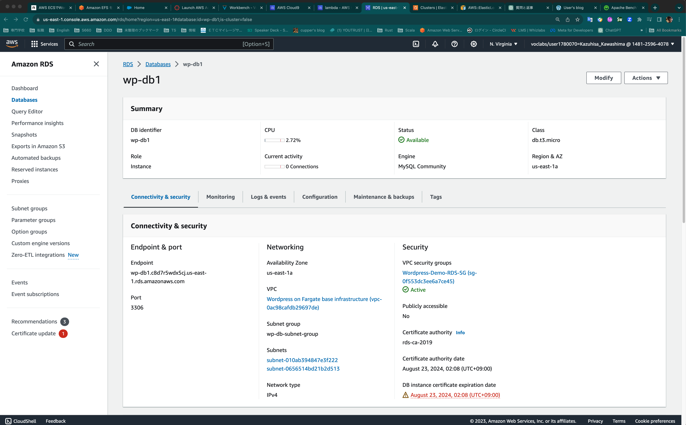

* EFS の情報
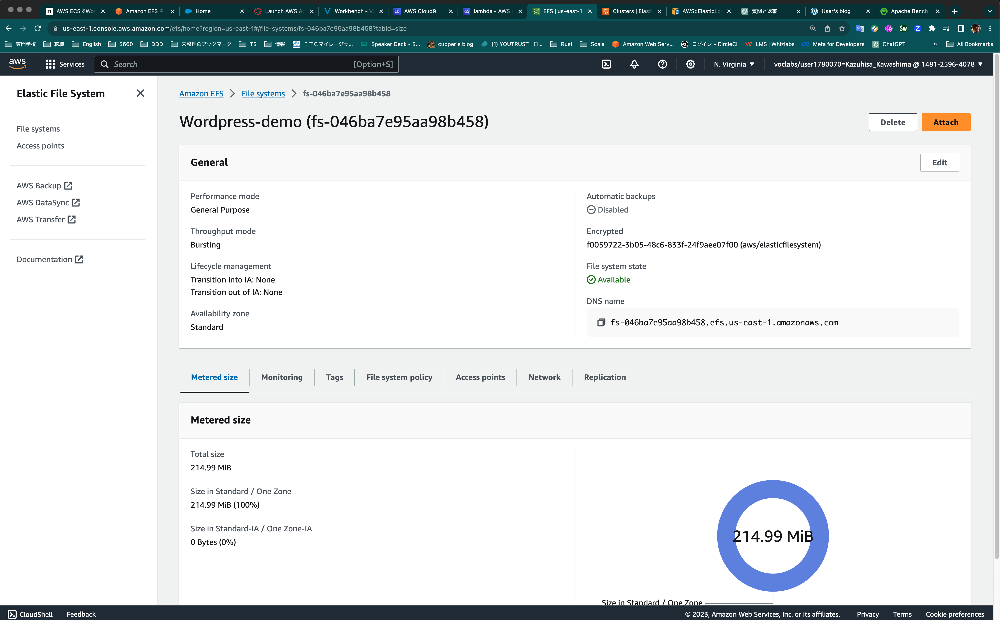

* ECS タスク定義の情報
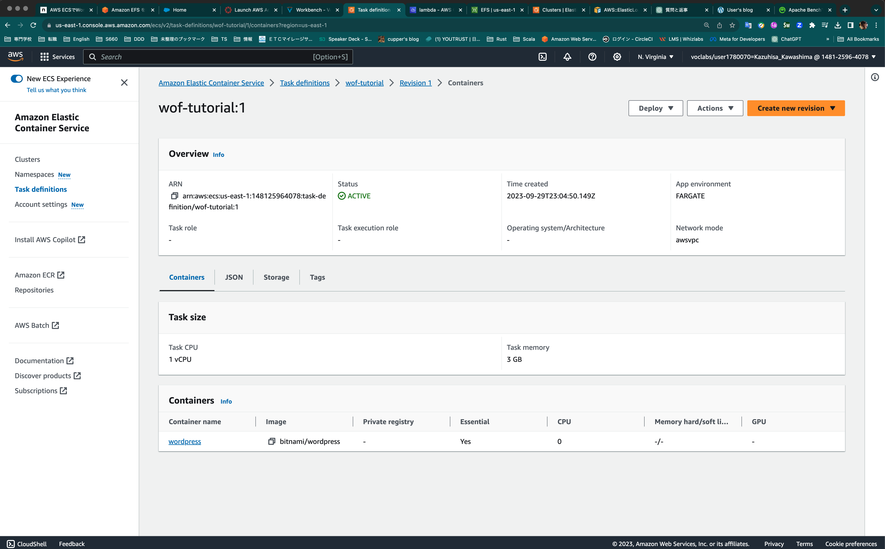

* ECS クラスタの情報  
__クラスタに紐づくサービスとタスクがわかるようにしてください。__
  * サービスの情報
  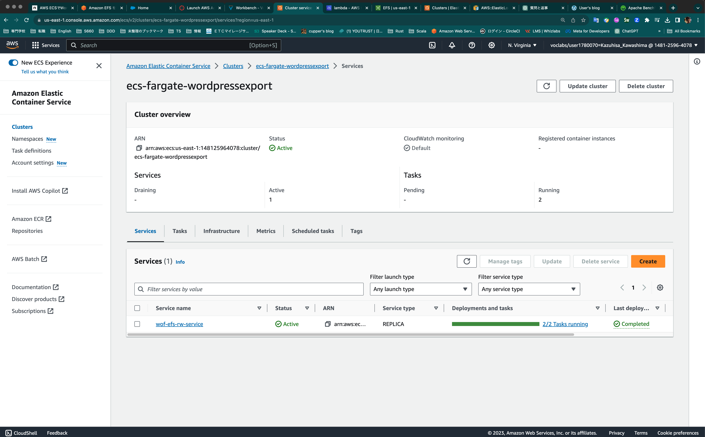

  * タスクの情報
  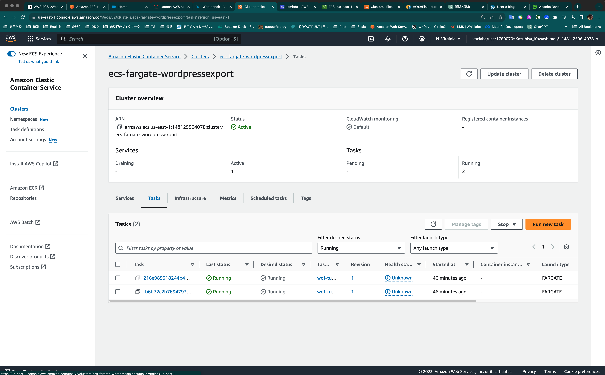

* ターゲットグループの情報  
__ターゲットグループに紐づくターゲットがわかるようにしてください。__  
__各ターゲットの状態が `healthy` になっていることを確認してください。__
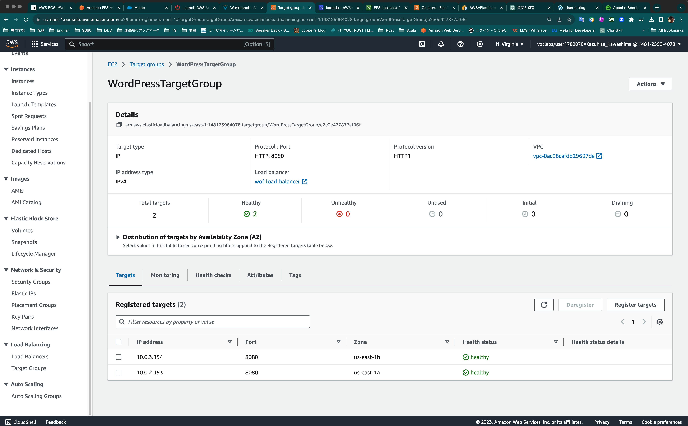
